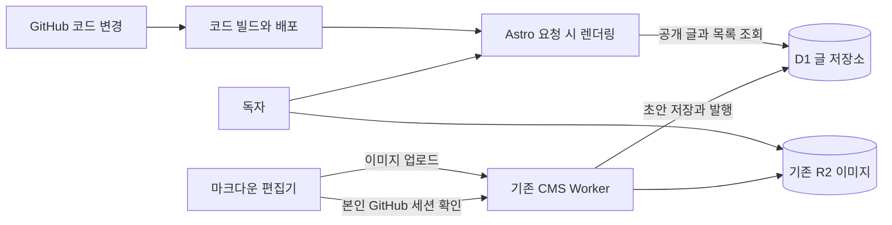

# 빌드 대기 없는 글 발행 설계

- 작성일: 2026-09-26
- 상태: 프로덕션 D1 즉시 발행 전환 및 운영 검증 완료 (2026-09-27)
- 목표: 글 발행·수정·삭제를 사이트 코드 배포와 분리한다.

## 조사 범위와 확인한 사실

Cloudflare `devlog`의 Recent builds 순서를 확인했다. 이전 답변에서 분석한 `e6a8dabf`를 제외하고 최신순으로 다음 세 건을 열어 초기화·의존성 설치·실제 빌드·검색 색인·배포 구간을 확인했다. 두 건은 개발 브랜치의 버전 업로드이며 프로덕션 배포가 아니다.

| 최신순 | 빌드 / 커밋            | 변경 / 대상                                | 전체     | 초기화   | 복제 | 설치 | 빌드 | 배포 |
| ------ | ---------------------- | ------------------------------------------ | -------- | -------- | ---- | ---- | ---- | ---- |
| 1      | `9cff7ace` / `b89d378` | 테스트 글 삭제 / main                      | 5분 36초 | 4분 41초 | 4초  | 19초 | 13초 | 18초 |
| 2      | `852ac232` / `6be039c` | 접근 제한 코드 서식 / codex/protect-editor | 5분 32초 | 4분 15초 | 6초  | 21초 | 15초 | 34초 |
| 3      | `900eb1ac` / `6463cfc` | 편집기 접근 제한 / codex/protect-editor    | 5분 35초 | 4분 21초 | 6초  | 34초 | 16초 | 18초 |

시간은 대시보드의 단계별 표기를 그대로 기록했다. 반올림과 단계 밖 처리 때문에 합계가 전체 시간과 조금 다를 수 있다. 특히 두 번째의 배포 단계 표시는 34초지만 명령 실행 완료 로그의 구간은 이보다 짧다. 단계 표시와 명령 실행 시간을 같은 것으로 해석하지 않는다.

빌드 링크:

- [9cff7ace](https://dash.cloudflare.com/eb646c21c39e091da90f6cc4ec4f4680/workers/services/view/devlog/production/builds/9cff7ace-75e4-47d2-913c-138fad85f372)
- [852ac232](https://dash.cloudflare.com/eb646c21c39e091da90f6cc4ec4f4680/workers/services/view/devlog/production/builds/852ac232-3ad2-49fa-b4b1-91dea381fe77)
- [900eb1ac](https://dash.cloudflare.com/eb646c21c39e091da90f6cc4ec4f4680/workers/services/view/devlog/production/builds/900eb1ac-a86f-4039-a391-51f6836e6cbe)

평균 전체 시간은 약 5분 34초, 초기화는 약 4분 26초로 전체의 약 79%다. 실제 빌드는 평균 약 15초다. 세 건 모두 의존성과 빌드 출력 캐시 복원 성공 메시지가 있다. 의존성 설치는 1,010개 패키지를 재사용했고 다운로드는 0개였다.

세 건 모두 `astro build --force && pagefind --site dist`를 실행하고 `data store cleared (force)`를 기록했다. 콘텐츠 동기화는 각각 약 4.255초, 4.258초, 4.744초였다. Pagefind는 각각 125 / 126 / 126개 페이지를 색인했고 0.555 / 0.744 / 0.755초가 걸렸다. 첫 건은 HTML 324개를 탐색했다. Wrangler는 각각 9 / 8 / 11개 변경 자산만 올렸고, 자산 업로드 자체는 약 1초였다.

**판단:** 현재 5분 지연의 가장 큰 구간은 Cloudflare 초기화다. 초기화 내부에서 왜 약 4분이 걸렸는지는 이 로그에 설명이 없다. 실행 환경 할당, 대기열, 서비스 장애 중 어느 것인지 단정할 수 없다. 개발 브랜치 빌드가 프로덕션 빌드를 막았다는 근거도 없다.

## 현재 코드에서 생기는 구조적 문제

- `WriteEditor.tsx`의 `save()`는 GitHub 초안 브랜치 생성, 파일 커밋, PR 생성, 발행 시 PR 병합을 수행한다. 병합 재시도 대기도 있어서 Cloudflare 로그의 시간은 버튼을 누른 뒤의 전체 대기 시간을 전부 포함하지 않는다.
- `astro.config.mjs`는 정적 출력이다. 글을 추가하면 새 HTML과 목록을 배포해야 공개된다.
- `src/lib/content.ts`는 전체 공개 글을 읽고 시리즈·태그·연도 목록을 만든다. 프로덕션에서 결과를 한 번 메모하므로 페이지마다 파일을 다시 전부 읽는 구조는 아니다. 그래도 한 번의 전체 수집과 각 페이지 렌더링이 필요하다.
- `src/pages/blog/[slug].astro`는 모든 공개 글을 정적 경로로 만든다. Pagefind도 HTML을 다시 탐색한다.
- `src/pages/write.astro`의 내 글 목록은 빌드 시점의 데이터다. 백오피스 목록조차 배포와 연결되어 있다.
- `ArticleLayout.astro`의 이전/다음 글과 시리즈 목록, `BaseLayout.astro`의 내비게이션은 다른 글의 데이터에도 의존한다. 증분 빌드에 `post.digest`만 넣으면 이 정보가 갱신되지 않을 수 있다.
- `src/pages/blog/index.astro`는 글 전체를 목록에 넣고, `search-index.json.ts`는 전체 본문을 반환한다. 글이 수천 개면 페이지 크기와 클라이언트 다운로드량도 별도 문제다.
- 이미지 정리 작업은 현재 Git 브랜치만 참조 검사한다. 글 저장소를 바꾸면 정리 기준도 함께 바꿔야 한다.

## 대안 비교와 권고

| 대안                              | 해결 범위                          | 남는 문제                                            | 권고                       |
| --------------------------------- | ---------------------------------- | ---------------------------------------------------- | -------------------------- |
| `--force` 제거와 Astro 증분 빌드  | 콘텐츠 재처리·페이지 렌더링 감소   | 약 4분 초기화, 발행마다 빌드, 목록·검색 처리         | 전환 전 보조 개선          |
| GitHub Actions에서 빌드·배포      | Cloudflare Builds 초기화 구간 우회 | Actions 대기·전체 정적 빌드, 별도 배포 토큰 필요     | 우선 시도                  |
| Astro 요청 시 렌더링 + D1 글 저장 | 글 발행에서 빌드·PR·배포 제거      | DB·Worker 운영, 마이그레이션, SSR CPU 한도 검증 필요 | 발행 즉시 반영이 필수일 때 |

### 블로그 데이터에 맞는지 확인

현재 저장소를 직접 집계한 결과 공개·초안 Markdown 파일은 126편, 원본 합계는 629,895바이트(약 0.60 MiB)다. 평균 4,999바이트, 중앙값 4,139바이트, 95백분위 14,048바이트, 최댓값 20,638바이트다. MDX 파일은 없었다. 126편의 원문 크기만 보면 DB 도입을 요구할 만큼 크지 않다. 단순 비례 추정으로 1,000편 원문은 약 5MB지만, 렌더링 HTML·검색 색인·인덱스 저장량과 실제 증가율은 별도 측정해야 한다.

D1 Free에는 계정 전체 5GB 저장, 하루 500만 행 읽기, 10만 행 쓰기가 포함되고 개설·유휴 시간 요금은 없다. 단일 DB 최대 크기는 Free 500MB다. 현재 글 데이터에는 넉넉하다. 인덱스 조회를 쓰면 글 하나를 위한 요청은 전체 글을 매번 읽을 필요가 없다. 다만 쿼리가 실제 검사한 행 기준으로 과금 한도를 계산하므로, 전체 스캔이 남지 않게 측정해야 한다. Free 한도 초과 시 자동 결제 대신 당일 DB 요청이 실패한다. [D1 요금](https://developers.cloudflare.com/d1/platform/pricing/), [D1 한도](https://developers.cloudflare.com/d1/platform/limits/).

D1 요금이 무료라는 사실만으로 Astro SSR 전환 비용도 무료라고 결론내릴 수 없다. 현재 계정의 Worker 요금제는 이 조사에서 확인하지 못했다. Workers Free는 요청당 CPU 10ms, 하루 100,000 요청이다. Cloudflare는 SSR과 파싱처럼 무거운 작업이 통상 10~20ms를 쓸 수 있다고 안내한다. 기존 Shiki 문법 강조와 Astro 레이아웃을 매 요청에 SSR하면 Free CPU 한도를 넘을 수 있다. [Workers 한도](https://developers.cloudflare.com/workers/platform/limits/).

따라서 DB 사용 적합성은 **높음**, Astro SSR 전체를 그대로 무료 Worker에서 돌리는 적합성은 **미검증**이다. D1을 택한다면 글 발행 때 서버에서 한 번 렌더링해 D1에 검증된 HTML과 메타데이터를 저장하고, 공개 요청에서는 인덱스로 글 한 편을 읽어 가벼운 템플릿에 넣는다. 그래도 실제 Worker CPU·메모리와 번들 크기를 시험 배포에서 재야 한다. 10ms를 넘으면 경량 Worker 템플릿을 사용하거나 Workers Paid 비용을 확인한다. 프로덕션 전환 전에 현재 Worker 요금제와 대표 글 CPU 측정을 필수 판정 항목으로 둔다.

즉 **D1 자체는 이 블로그의 데이터 양에 잘 맞지만, 이 빌드 지연만 해결하려고 바로 도입할 근거는 부족하다.** 최신 로그에서는 글 처리·렌더링이 아니라 Cloudflare 빌드 초기화가 4분 넘게 걸렸다. 같은 정적 빌드를 GitHub Actions에서 실행하면 Markdown 저장 방식과 사이트 출력을 보존하면서 Cloudflare 빌드 초기화를 우회할 수 있다. Cloudflare는 외부 CI/CD와 GitHub Actions 배포를 공식 지원한다. Actions 시작 대기와 배포 완료 시간은 아직 측정하지 않았으므로 먼저 시범 배포로 재야 한다. Cloudflare 배포를 위해 GitHub Secrets에 계정 한정 Workers 편집 API 토큰이 필요하다. [Cloudflare GitHub Actions 안내](https://developers.cloudflare.com/workers/ci-cd/external-cicd/github-actions/).

**수정 권고:** 기존 정적 사이트와 Markdown 원본을 유지하고, Cloudflare 자동 빌드·배포를 GitHub Actions 배포로 옮겨 실제 대기 시간을 먼저 비교한다. 글 한 편의 변경도 전체 빌드는 하므로 글 수에 따라 빌드 시간이 계속 늘어난다. Actions 방식이 사용자 요구의 속도 기준을 못 맞추거나 대량 글에서 빌드 시간이 문제가 될 때 D1 기반 무빌드 발행으로 넘어간다. 사용자가 발행 성공 후 거의 즉시(수초 안에) 공개되어야 한다고 확정한다면 D1 설계를 시험한다. 현재 공개 트래픽은 확인하지 못했으므로 어느 쪽이든 한도 여유를 숫자로 보장하지 않는다.

Astro 증분 정적 빌드는 실험 기능이다. 데이터 해시와 코드 의존성이 같으면 정적 경로의 출력을 재사용한다. 캐시는 Cloudflare가 지원하는 `node_modules/.astro`에 보존할 수 있다. 그러나 실제 빌드 13~16초를 줄여도 주된 초기화 구간은 그대로다. 이전/다음 글과 내비게이션의 변경까지 캐시 키에 포함하면 상당수 글이 다시 렌더링될 수도 있다. 즉시 발행의 주된 해결책으로 사용하지 않는다.

근거: [Astro 증분 빌드](https://docs.astro.build/en/reference/experimental-flags/incremental-build/), [Cloudflare 빌드 캐시](https://developers.cloudflare.com/workers/ci-cd/builds/build-caching/).

## 추천 구조

Astro와 현재 편집기·레이아웃을 유지하고 Cloudflare 어댑터를 추가한다. 이미지 저장은 기존 R2, 글의 원본과 공개 상태는 D1을 사용한다. GitHub는 코드 배포와 기존 콘텐츠 보존에 사용한다. 새 글의 발행 경로에는 GitHub 커밋·PR이 필요하지 않다.

Astro 공식 Cloudflare 어댑터는 요청 시 렌더링을 지원하며 페이지별 활성화도 가능하다. D1은 Worker에서 SQL로 접근할 수 있다. 프레임워크를 교체할 이유는 없다. [Cloudflare 어댑터](https://docs.astro.build/en/guides/integrations-guide/cloudflare/), [D1](https://developers.cloudflare.com/d1/).

### 저장과 발행 규칙

1. 초안 저장은 D1의 비공개 초안을 갱신한다. 이미 공개된 글의 초안을 수정해도 공개본은 그대로 유지한다.
2. 발행 요청을 받은 서버가 제목·슬러그·시리즈·태그·버전·이미지 참조를 검증한다. 슬러그 중복은 DB 제약으로 최종 차단한다.
3. 해당 글 한 편의 마크다운을 서버에서 HTML·목차·검색용 텍스트로 변환한다. 브라우저가 보낸 HTML은 신뢰하지 않는다. 렌더링 실패 시 공개본을 교체하지 않는다.
4. 글의 공개본, 태그 관계, 검색 색인, 이미지 참조를 D1 `batch()`의 트랜잭션으로 함께 갱신한다. 중간 실패 시 모두 되돌린다.
5. 커밋이 끝난 뒤 공개 URL과 버전을 반환한다. 편집기는 공개 URL을 열 수 있게 표시한다. 응답을 받지 못한 재시도는 요청 ID로 중복 발행을 막는다.

초기 구현은 초안과 공개본을 별도 테이블로 두는 작은 구조로 시작한다. 전체 버전 관리 시스템은 만들지 않는다. 각 글에 수정 버전을 두고 오래된 탭에서 덮어쓰려 하면 충돌을 반환한다. 최초 `publishedAt`은 유지하고 수정 발행 때 `updatedAt`만 바꾼다. 시각은 서버가 확정하고 요청 시작 시각을 사용한다.

글 원본·HTML을 D1에 함께 두면 글 공개를 R2와 DB의 이중 쓰기에 의존하지 않아도 된다. 행 크기 제한에 맞춰 본문·HTML 크기를 검증한다. 현재 D1의 행 제한은 2,000,000바이트다. 큰 글의 R2 분리는 실제 필요가 확인될 때 고려한다. [D1 트랜잭션](https://developers.cloudflare.com/d1/worker-api/d1-database/#batch), [D1 제한](https://developers.cloudflare.com/d1/platform/limits/).

### 읽기·검색·수천 편 대응

- 글 상세는 슬러그 인덱스로 한 편을 조회하고 저장된 HTML을 렌더링한다. 독자의 요청마다 마크다운 전체를 변환하지 않는다.
- 홈·전체 글·시리즈·태그·내 글 목록은 최신순 커서 페이지네이션으로 20개씩 읽는다. 본문은 목록 응답에 포함하지 않는다.
- 시리즈 목록과 글 수는 SQL 집계로 조회한다. 내비게이션도 한 번에 모든 글 제목을 보내지 않고 필요한 범위만 읽는다. 이전/다음 글은 날짜·ID 인덱스로 제한 조회한다.
- `getContent()`의 프로덕션 전역 메모는 런타임 글 조회에 재사용하지 않는다. Worker가 살아 있는 동안 새 글을 놓칠 수 있다.
- Pagefind와 전체 본문 JSON 다운로드를 런타임 검색 API로 바꾼다. D1 FTS5 색인은 발행 트랜잭션에서 해당 글만 갱신한다. 한국어 띄어쓰기·부분 검색·짧은 검색어는 실제 글로 확인해 요구 동작을 확정한다. FTS5 지원 자체가 한국어 검색 품질을 보장하지 않는다.
- RSS는 최신 글 범위를 조회하고 sitemap은 URL·수정일만 조회해 분할한다. 홈페이지·글·시리즈·태그·RSS·sitemap 모두 같은 공개 데이터 기준을 사용한다.

발행 시 작업량은 해당 글 길이, 태그 수, 첨부 수에 주로 좌우되도록 한다. 전체 1,000편을 다시 렌더링하거나 색인하지 않는다. DB 인덱스 갱신·집계 비용은 남으므로 모든 작업이 엄밀히 상수 시간이라고 주장하지 않는다. [D1 인덱스](https://developers.cloudflare.com/d1/best-practices/use-indexes/), [D1 FTS5 지원](https://developers.cloudflare.com/d1/sql-api/sql-statements/).

### 즉시 반영과 캐시

첫 구현은 글과 목록 HTML의 공유 캐시를 끄고 D1의 기본 주 DB에서 읽는다. 초안·인증 응답도 `private, no-store`다. CSS·JS·R2 이미지 캐시는 계속 사용한다. 이 방식이면 발행 후 오래된 HTML 캐시가 새 글을 가리는 경로를 줄일 수 있다.

트래픽 측정 후 HTML 캐시를 추가한다. 그때는 DB의 공개 버전을 기준으로 캐시 키를 만들고 수정·삭제·슬러그 변경·목록 갱신을 함께 설계한다. 짧은 TTL만 넣고 즉시 반영이라고 표현하지 않는다. 읽기 복제를 사용하게 되면 D1 세션·bookmark를 통한 일관성도 설계한다.

초기 목표는 1,000편 데이터에서 발행 응답 p95 5초 이내, 성공 응답 직후 새 요청으로 상세·목록·검색에 새 버전이 보이는 것이다. 이는 구현 후 측정할 합격 기준이며 현재 달성한 성능 수치가 아니다. 마크다운 처리의 Worker CPU·메모리·번들 한도도 실제 긴 글과 코드 블록으로 측정한다.

### 인증·삭제·이미지 정리

- 기존 GitHub 허용 계정 검증과 서명된 HttpOnly 세션을 CMS API에서 재사용한다. 모든 쓰기 요청은 서버에서 인증·Origin·CSRF를 검증한다. DB·R2 비밀값을 브라우저에 전달하지 않는다.
- `/write`와 `/admin`의 로그인 이전 접근 차단을 새 Astro 런타임에서도 유지한다. 공개 조회 API는 초안과 삭제본을 반환하지 않는다.
- 글 삭제는 우선 휴지통 상태로 전환한다. 삭제·복구 시 검색 색인과 공개 목록을 함께 변경한다. 이미 발행된 글을 초안으로 수정하는 것과 공개 삭제를 구분한다.
- 이미지 참조는 초안·공개본·복구 가능한 삭제본까지 포함한다. R2 이미지 업로드와 7일 미참조 유예를 유지한다.
- DB 전환 전 기존 Git 기반 자동 삭제 작업을 중지한다. DB에만 있는 새 글의 이미지를 기존 작업이 지우지 못하게 한다. 전환 중에는 Git과 DB 참조를 합치고, 최종적으로 서버의 DB 참조와 R2 객체를 기준으로 정리한다. 읽기 실패 시 삭제를 멈추고 삭제 직전 참조를 재확인한다. 정리와 첨부 저장의 동시 실행도 조정한다.

## 구현 순서와 롤백

1. **우선 시도:** 현재 `pnpm build`를 유지하고 Cloudflare 통합 빌드 대신 GitHub Actions에서 빌드와 Wrangler 배포를 실행한다. 필요한 API 토큰은 `whateveriiwant/devlog` 저장소의 Actions 비밀값으로, 해당 Cloudflare 계정의 Workers 배포에만 권한을 제한한다. Cloudflare의 기존 배포 경로와 경쟁 배포가 생기지 않도록 새 경로가 확인된 뒤 통합 빌드를 끈다. 대표 글 변경 후 병합부터 공개 URL 반영까지 총 대기 시간을 잰다. `--force` 제거는 별도 보조 개선으로 평가한다.
2. **읽기 검증:** 현재 main을 고정한 스냅샷에서 글·시리즈를 D1으로 가져온다. 정적 사이트는 계속 운영한다. ID·슬러그·날짜·이미지 주소를 보존하고 콘텐츠 수·해시·목록·대표 HTML을 비교한다. 레거시 초안 PR도 별도로 가져오고 검증한다.
3. **런타임 연결:** Cloudflare 어댑터, D1 조회, 공유 마크다운 처리, 페이지네이션, 검색·RSS·sitemap을 테스트 환경에서 연결한다. 파일 시스템을 읽는 `rehype-content.mjs`는 필요한 맵을 입력으로 받도록 바꿔 런타임에 맞춘다. 이미지 변환은 기존 R2 주소를 그대로 출력하도록 설정한다.
4. **쓰기 검증:** 초안·발행·수정·삭제·복구 API와 편집기를 연결한다. 인증 차단, 충돌, 슬러그 중복, 재시도, 렌더링 실패, 이미지 유예를 검증한다. Git 기반 이미지 정리를 중지하거나 새 기준으로 교체한다.
5. **전환:** 잠시 글쓰기를 멈추고 main과 초안을 최종 동기화한 뒤 런타임 읽기·쓰기를 함께 활성화한다. 기존 글 경로·SEO 정보를 비교하고 새 글을 실제 공개 경로에서 확인한다. 이후 글 데이터 백업이 코드 빌드를 유발하지 않도록 빌드 감시 경로를 조정한다.

전환 전에는 Git 파일과 기존 정적 배포를 보존한다. 전환 후 새 글이 생겼으면 예전 정적 버전으로 단순 롤백하지 않는다. 먼저 D1의 최신 글을 Markdown으로 내보내 Git에 반영하고 정적 사이트를 만들어야 새 글을 잃지 않는다. 삭제 상태도 내보내기에서 반영한다. DB 정기 백업·Markdown 내보내기를 제공하며 백업 실패는 발행 성공과 별도로 표시한다.

GitHub Actions가 속도 기준을 충족하면 Markdown과 정적 출력을 유지한다. 충족하지 못하면 D1 전환을 판단한다. D1 선택 시 완료 기준은 1,000편에서 글 발행이 코드 빌드를 시작하지 않고, 성공 응답 후 공개 상세·최신 목록·검색에 반영되는 것이다. 수정 초안은 공개본을 바꾸지 않고, 삭제·복구·인증 차단·7일 이미지 유예가 유지되어야 한다. 대표 글의 Worker CPU·메모리, Worker 요금제, D1 행 읽기 수와 데이터 보존 검증이 끝나기 전 D1 프로덕션 읽기·쓰기를 전환하지 않는다.

## 이번 작업의 상태

### GitHub Actions 배포 전환

GitHub Actions에서 `pnpm check`, 정적 빌드, Wrangler 배포를 순서대로 실행하도록 바꿨다. Cloudflare Worker의 Git 빌드 연결을 끊어 두 배포가 경쟁하지 않게 했다. 배포용 API 토큰은 저장소 Actions 비밀값으로 제한했고, 새 토큰으로 배포를 다시 실행해 성공을 확인했다.

2026-09-26 확인한 성공 실행은 전체 약 55초, 빌드 작업 약 51초였고 Wrangler 배포 구간은 약 10초였다. 818개 자산 중 4개가 변경 업로드됐다. 프로덕션 `https://seungjun.sh`는 HTTP 200을 반환했다. 이전 5분 34초보다 크게 줄었지만 발행 후 수초 안에 공개되는 기준은 충족하지 못한다. 콘텐츠 발행은 여전히 코드 배포와 연결돼 있어 D1 실시간 경로 검증을 이어간다.

### D1 읽기 이전 시험

Cloudflare 계정 대시보드에서 Workers Free 요금제를 확인했다. 이 계정의 무료 요청 CPU 제한은 요청당 10ms이며, D1은 무료 요금제에서 하루 500만 행 읽기와 10만 행 쓰기를 포함한다. 그래서 이 단계에서는 프로덕션 Worker에 SSR을 배포하지 않았다. [Cloudflare 요금제 화면](https://dash.cloudflare.com/eb646c21c39e091da90f6cc4ec4f4680/workers/plans), [Workers 한도](https://developers.cloudflare.com/workers/platform/limits/), [D1 요금](https://developers.cloudflare.com/d1/platform/pricing/).

격리된 APAC 리전 D1 `devlog-content-stage`와 `devlog-cms-stage` Worker를 만들었다. staging 검증 당시에는 프로덕션 Worker에 바인딩하지 않았다. 기존 Git Markdown을 시험 DB에 적재했다. 검증 결과 원본 125편과 D1 125편의 ID·슬러그·콘텐츠 해시가 모두 일치하고 시리즈 23개도 일치한다. 슬러그 중복, 유효하지 않은 발행일, 존재하지 않는 시리즈 참조는 없었다. 기존 이미지 매니페스트를 이용해 글·썸네일의 이미지 참조 199개를 확인했다. Markdown 본문 약 0.33MB와 미리 렌더링한 HTML 약 0.99MB를 넣은 D1 크기는 약 2.65MB였다. 현재 데이터 양은 무료 저장 한도보다 훨씬 작지만, 본문·HTML을 포함한 콘텐츠 행은 125개뿐이라 모든 요청에서 글 목록 전체를 가져오는 구조로는 옮기지 않는다.

시험 Worker `/_stage/health`는 D1 연결과 적재 개수를 반환한다. 시험 URL `https://devlog-cms-stage.seungjun-jeong10.workers.dev/_stage/health`에서 `{ "ready": true, "posts": 125, "series": 23 }`을 확인했다. 이 경로는 `STAGE_HEALTH=true`인 별도 시험 환경에서만 응답한다. 공개 API `GET /posts?limit=20&cursor=...`, `GET /posts/{slug}`, `GET /series`, `GET /tags`도 stage에만 올려 시험했다. 3개씩 조회한 두 커서 페이지가 겹치지 않았고, HTML·목차·R2 이미지 주소와 시리즈 23개·태그 170개가 응답됐다. 허용하지 않은 Origin은 403이었다. 응답은 `no-store`다. 상세·목록·시리즈·태그 API를 staging 사이트에서 사용하도록 연결했다.

현재까지 변경한 것은 D1 스키마·데이터 검증 도구·읽기 API와 staging 사이트 Worker 연결이다. 글 상세 두 편의 렌더링과 함께 `/blog/` 첫 20편, 이어보기 40편, 시리즈 23개, 태그 170개, 태그/시리즈별 글 목록을 확인했다. 태그 화면은 브라우저에서 D1 집계 170개로 갱신되는 것을 확인했고, 검색어 `Stale Closure`가 기대한 글 1편을 반환했다. RSS는 D1 공개 글 125편, sitemap은 323개 URL을 반환했다. 미존재 글과 내부 템플릿 URL은 404, 외부 Origin API 요청은 403, 비로그인 `/write`는 `/login/`으로 리다이렉트됐다.

단계 검사 `pnpm check`는 오류 0·경고 0·힌트 1, `pnpm build`는 성공했다. Worker tail에서 글 상세는 CPU 2~~5ms, 목록은 4~~8ms(여러 표본), RSS 5ms, sitemap 6ms를 관측했다. 추가 표본은 글 목록 2ms, 시리즈 2ms, 태그 3ms, 태그 관계 2ms, sitemap 항목 6ms, RSS 1ms였다. 모두 staging 125편 기준이며 1,000편 부하는 검증하지 않았다.

검색·피드·목록 읽기는 staging에서 D1을 본다. 프로덕션 편집기와 공개 사이트는 기존 GitHub PR·정적 배포를 유지하며, 즉시 발행 전환은 아직 아니다.

### D1 편집기 쓰기 경로 (staging 기본 흐름 검증 완료)

편집기 D1 API와 UI 전환 코드를 추가했다. 공개 글 행과 분리된 `post_drafts`에 초안을 저장해 공개 중인 글을 감추지 않게 했고, 발행 때만 서버에서 마크다운을 정화·렌더링한 후 D1 batch로 공개본·시리즈·이미지 참조를 갱신한다. `post_draft_images`는 초안이 참조하는 이미지를 별도로 추적해 정리 작업 중 삭제되지 않게 한다. 요청 ID로 중복 쓰기를 식별하고, 초안 버전과 공개 버전을 확인해 오래된 탭의 덮어쓰기를 거절한다. `/write` 접근은 staging에서 로그인 화면으로 보내며, API는 GitHub 허용 계정 토큰을 검증한다. 운영 Worker에는 쓰기 기능을 켜는 변수를 설정하지 않았다.

Cloudflare staging D1에 `0002_post_drafts.sql`, `0003_post_draft_images.sql`을 적용했고 CMS·사이트 Worker를 staging에 배포했다. `GITHUB_CLIENT_SECRET`, `SESSION_SECRET`을 stage Worker에 설정하고 GitHub OAuth 앱에 staging callback을 추가한 뒤 허용 계정 로그인 및 `내 글` 목록의 D1 125편 조회를 확인했다. 임시 저장으로 `post_drafts`만 생성되고 공개 글은 생성되지 않는 것, 발행 후 stage 공개 페이지에서 Markdown 본문·목차가 표시되고 `published_at`/`updated_at`이 기록되는 것을 검증했다. 공개 글 수정은 초안 저장 중 기존 공개본을 유지했고, 재출간 시 revision이 1에서 2로 증가하며 `updated_at`만 갱신되고 `published_at`은 유지됐다. staging 전용 R2 `devlog-assets-stage`를 만들고 CMS에 연결해 테스트 업로드가 운영 버킷에 닿지 않게 분리했다. 휴지통 이동은 공개 상세를 404로 만들고, 복구 후 목록에 다시 나타나는 것까지 staging에서 확인했다. 테스트 데이터 정리 후 D1은 글 125편·초안 0건이다. 프로덕션에는 배포하거나 데이터를 쓰지 않았다.

이번 `pnpm check` 결과 오류 0, 경고 0, 힌트 3이며 `pnpm build`와 stage Worker 배포가 성공했다. 빌드에는 기존 CSS 최적화 경고 5개가 남았다. 편집기의 기본 저장·발행·수정·휴지통·복구 흐름까지 staging에서 확인했다. 동일 슬러그 입력은 저장 전에 차단했다. 동일 제목이더라도 기존 수동 슬러그와 자동 슬러그가 다르면 중복이 아니므로 저장 가능한 것을 확인했다. Chrome에서 PNG 파일을 staging 편집기에 실제 업로드해 이미지가 즉시 표시되고 staging 미디어 URL에서 1×1 이미지가 로드되는 것을 확인했다. 그 이미지가 초안 `post_draft_images`에 등록된 뒤 테스트 초안·요청·참조와 R2 객체를 제거했으며, 해당 미디어 URL은 404로 돌아왔다. staging 편집기에서 임시저장 빠른 더블클릭 후 D1에는 초안 1건·revision 1·저장 요청 1건만 생성됐다. 같은 요청 ID를 DevTools Network의 `Resend`로 다시 전송해 `{duplicate:true}` 응답을 확인했고, D1 초안 revision 2와 해당 글의 요청 로그 2건이 그대로 유지됐다. 테스트 초안·이미지 참조·요청 로그를 삭제하고 네 항목 모두 0건임을 확인했다. 두 탭에서 같은 초안을 열고 한쪽이 revision 2를 저장한 다음 오래된 탭에서 저장을 시도하자 충돌 메시지가 표시됐고, D1에는 먼저 저장한 내용만 남았다. 31만 자 본문으로 편집기 미리보기 과부하를 발견해 10만 자 초과 시 미리보기를 생략하도록 수정·stage 배포했다. 수정 후 같은 본문 길이에서도 편집기가 응답했고, 저장은 성공했다. 발행 시 렌더 HTML 제한 초과(413)가 반환되고 초안은 남으며 공개 글은 생성되지 않았다. 시험 데이터는 정리했다. 렌더러의 예외(422) 자체를 강제로 만드는 검증은 남았다.

### 프로덕션 D1 사전 준비

2026-09-26 APAC D1 `devlog-content`(ID `1facc419-3266-4cb5-9515-d8cab3924f1d`)를 생성했다. 마이그레이션 파일 번호 충돌을 발견해 새 DB에서도 실행 순서가 고유하도록 `0001`~`0004`로 정리했다. staging에는 새 마이그레이션을 적용했고, 데이터 125편·시리즈 23개·이미지 참조 199개가 유지됐다. staging CMS·사이트 Worker도 변경 코드로 다시 배포했다. 편집기 설정은 활성, 비로그인 쓰기는 401, 글 목록·태그·RSS·sitemap 사이트 응답은 200이었다.

운영 D1에는 Git Markdown 스냅샷을 넣었다. 운영·staging 각각 125편, 23개 시리즈, 199개 이미지 참조가 일치했고 ID·슬러그·해시 불일치 0, 렌더 누락 0, 오래된 이미지 호스트 0이었다. 운영 D1 전체 SQL 백업은 저장소의 무시 경로 [`migration/backups/devlog-content-before-cutover-2026-09-26.sql`](../migration/backups/devlog-content-before-cutover-2026-09-26.sql)에 보관했다. 별도 SQLite로 복원해 125편·23개 시리즈·199개 이미지 참조·초안 0건을 확인했다. 운영 설정은 이 DB를 바인딩하되 `CONTENT_READS=false`, `CONTENT_WRITES=false`로 두었다. 운영 Worker에는 아직 배포하지 않았다.

배포 워크플로 코드는 CMS Worker를 먼저 배포하고 사이트 Worker를 이어서 배포하도록 준비했다. 운영 편집기 설정이 꺼져 있으면 기존 GitHub 글쓰기 경로를 유지한다. 이미지 정리 워크플로는 D1과 Git 참조를 합산하며, 수동 실행은 기본적으로 삭제 없는 dry-run을 하도록 바꿨다. 배포 Actions 토큰이 D1 조회 권한을 가졌는지 이 브랜치의 수동 dry-run으로 확인한다. 권한 확인 전에는 운영 전환하면 안 된다. GitHub Actions를 통해 스크립트가 D1을 읽지 못하면 삭제는 중단되도록 되어 있다.

### 2026-09-27: 프로덕션 CMS 배포 장애 복구

- 실패한 Actions 실행: [CI #30](https://github.com/whateveriiwant/devlog/actions/runs/36247276478), 시도 6. 사이트 빌드는 성공했고 CMS 배포가 메타데이터 조회 오류로 중단됐다.
- Wrangler 4.140.0/4.141.0의 `preUploadApiChecks()`는 Worker의 `last_deployed_from`이 `dash`이면 원격 설정 비교를 위해 바인딩·라우트·커스텀 도메인·서브도메인·환경·cron 메타데이터를 추가 조회한다. 이 여섯 요청 중 하나가 실패하면 공통 오류를 내므로 기존 로그만으로 실패한 개별 API는 특정할 수 없다.
- 기존 로컬 Cloudflare OAuth 로그인으로 main 커밋 `a1628c0`의 CMS를 배포했다. 명령은 `pnpm exec wrangler deploy --config wrangler.cms.jsonc --env=''`이며 업로드 3.40초, 트리거 배포 2.30초로 성공했다. 배포 버전은 `56de17e2-68cc-44cd-aa4a-dcd663b73c6c`다. D1 `devlog-content`와 R2 `devlog-assets` 바인딩이 반영됐다.
- 운영 `/editor/config`는 Origin `https://seungjun.sh` 요청에 200과 `enabled:false`를 반환한다. D1 발행 전환은 아직 꺼져 있다.
- 같은 main 커밋으로 Actions 시도 7을 실행해 CMS·사이트 배포와 전체 작업의 `success`를 확인했다. 토큰과 워크플로는 그대로다. 운영 메인·글 목록은 200, 비로그인 `/write/`는 `/login/`으로 302 응답했다. 배포 장애는 복구됐으며 D1 즉시 발행 활성화는 별도 단계다.
- Worker 메타데이터 읽기 권한은 추가하지 않았다. 대시보드에서 Worker나 secret을 다시 수정하면 원격 설정 비교가 다시 실행될 수 있다. 같은 오류가 재발하면 이미 승인된 OAuth 배포로 복구하고 Actions 재실행을 확인한다. 권한 확장은 별도 동의가 필요하다.

## 2026-09-27 전환 준비 및 복구 방법

- 운영 D1을 다시 검사해 글 125편·시리즈 23개·이미지 참조 199개와 원문 해시가 저장소와 일치함을 확인했다. 렌더 누락·슬러그 중복·잘못된 날짜·고아 시리즈는 0건이다.
- 새 운영 SQL 백업은 `migration/backups/devlog-content-before-cutover-2026-09-27.sql`에 있다. SQL 백업에는 공개본·초안·휴지통·이미지 참조·요청 기록이 포함된다.
- `scripts/export-d1-markdown.mjs`는 SQL 백업을 오프라인 SQLite에 복원하고 별도의 빈 디렉터리에 `src/content/posts`, `src/content/series.json`, `drafts`를 내보낸다. 휴지통 글은 `draft:true`로 숨기고, 미발행 수정은 공개본을 덮어쓰지 않도록 `drafts`에 분리한다. 출력 디렉터리가 존재하면 중단한다.
- 실제 백업의 125편 원문 보존을 확인했다. 오프라인 백업에 새 공개 글·휴지통 글·미발행 수정본을 추가한 시험에서도 분리 내보내기가 성공했다. 내보낸 데이터를 별도 저장소 사본에 적용해 Astro·Pagefind 빌드가 성공했고, 새 공개 글은 생성되며 휴지통 글은 생성되지 않았다.
- 이미지 정리의 실제 스크립트를 격리된 S3/D1 어댑터와 시계로 실행했다. 7일 직전 보존, 정확히 7일 경계의 삭제, dry-run 무변경, 재참조 마커 취소, 삭제 직전 D1 재참조 취소, 마커 유실 및 D1 조회 실패 시 이미지 보존을 확인했다. 실제 객체의 7일 경과 삭제를 실행한 검증은 아니다.
- 메인 페이지의 추천 글·최근 글·시리즈·태그·집계도 D1 조회로 연결했다. staging에서 D1 글 수 125와 최근 글 6편을 확인했다.
- D1의 404 및 장애 응답 뒤 정적 글을 다시 제공하던 경로를 제거했다. 삭제 글은 404이고 D1 장애는 503이다. 읽기 설정이 꺼졌을 때의 정적 복구 경로는 유지한다. 이 동작과 이미지 삭제 보호 검증을 CI에 추가했다.
- 운영 설정은 `CONTENT_READS=true`, `CONTENT_WRITES=true`로 전환하도록 변경했다. 실제 전환 완료 판정은 main Actions 배포 성공과 운영 로그인·저장·발행·수정·휴지통·복구 및 목록·검색·홈 반영 확인으로 한다.

### 정적 방식으로 되돌리는 순서

1. CMS의 `CONTENT_WRITES=false`를 배포해 쓰기를 잠시 중단한다.
2. 운영 D1의 최신 SQL 백업을 만든다. 전환 전 백업만 쓰면 전환 후 새 글과 수정이 빠지므로 최신 백업이 필요하다.
3. `node scripts/export-d1-markdown.mjs 최신백업.sql 존재하지않는출력경로`를 실행한다.
4. 출력의 `src/content/posts`와 `src/content/series.json`을 저장소 사본에 적용하고 빌드한다. `drafts`와 원본 SQL은 별도로 보관한다.
5. 복원한 정적 자산과 `CONTENT_READS=false`, `CONTENT_WRITES=false` 설정을 함께 배포한다. 기존 정적 자산만 두고 설정을 끄면 D1에서 쓴 새 글이 보이지 않는다.

### 운영 전환 및 검증 완료

[PR #16](https://github.com/whateveriiwant/devlog/pull/16)을 main에 병합했고, [프로덕션 CI #32](https://github.com/whateveriiwant/devlog/actions/runs/36251451406)는 1분 10초에 성공했다. 배포 커밋은 `a55e7b8`이다. 운영 편집기 설정은 `enabled:true`, 비로그인 편집 API는 401, 비로그인 `/write/`는 로그인으로 이동한다.

운영 브라우저에서 허용 계정 로그인 후 검증 글을 임시저장했다. D1에는 초안만 생성됐고 공개 글은 없었다. 68바이트 PNG를 첨부해 R2 업로드와 이미지 200 응답을 확인했다. 발행 후 상세·메인·최신 글 목록·검색·RSS·sitemap에 반영됐으며 홈 집계도 125에서 126으로 바뀌었다. 이 과정에서 Git main은 같은 커밋을 유지했다.

수정 초안 저장 중에는 이전 공개본과 검색 결과가 유지됐다. 재발행 뒤 본문과 검색 결과가 바뀌었고 최초 발행 일시는 유지되며 수정 일시는 증가했다. 휴지통 이동 후 상세 404·검색 결과 0건, 복구 후 상세 200·검색 결과 1건을 확인했다.

실제 D1에서 생성한 검증 글의 공개본·휴지통 상태·미발행 수정본을 `migration/backups/devlog-content-cutover-verification-2026-09-27.sql`로 백업했다. Markdown 내보내기 결과 공개 글 125편·숨긴 글 1편·별도 초안 1편이었으며, 공개본과 미발행 수정본이 덮어쓰이지 않고 각각 보존됐다.

검증용으로 생성한 글·초안·요청 기록·이미지 참조와 R2 객체만 정리했다. 이후 운영 D1은 기존 125편·시리즈 23개·이미지 참조 199개로 돌아왔고, 기존 원문 해시 불일치·렌더 누락·슬러그 중복은 0건이었다. 검증 URL은 404, 검증 검색 결과는 0건이다. 필수 전환 작업은 완료됐다. 실제 7일 동안 기다리는 운영 이미지 삭제 관찰과 수천 편 부하 측정은 이번 완료 판정에 포함하지 않았다.
